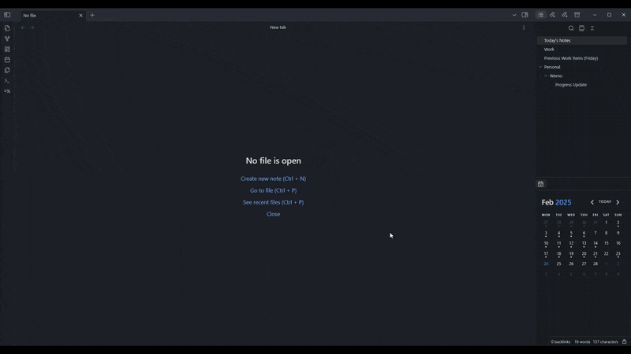

# Obsidian Smart Daily Notes Template


A smart daily notes template for Obsidian that automatically finds and links to your last work items. Perfect for developers who need quick access to their previous work during standups or status updates.

## Features

- 🔍 Finds your last work entry
- 🚫 Skips empty work logs automatically
- ⚡ Works with any folder structure
- 🛑 Built-in safety limits to prevent infinite loops
- 📱 Perfect for quick reference during meetings

## Preview



## Prerequisites

- Obsidian v1.8.7+
- Templater plugin

## Installation

1. Install the [Templater](https://github.com/SilentVoid13/Templater) plugin in Obsidian
2. Copy `template.md` to your Obsidian templates folder
3. Configure the template path in your daily notes settings
4. Customize the file path in the template to match your vault structure

## How It Works

Let's break down the key components:

### 1. Date Initialization
```javascript
const currentNoteDate = moment(tp.file.title.split('-').slice(0,3).join('-'), 'YYYY-MM-DD');
let checkDate = currentNoteDate.clone().subtract(1, 'days');
```
This gets us started with yesterday's date.

### 2. Smart Search Logic
```javascript
const maxDaysToLook = 14;  // Safety limit
let daysChecked = 0;
while (!fileFound && daysChecked < maxDaysToLook) {
```
We'll look back up to 14 days, preventing any infinite loops. This is handy for longer breaks or holidays.

### 3. File Path Handling
```javascript
const fileName = `${checkDate.format('YYYY-MM-DD')}-${checkDate.format('dddd')}`;
const filePath = `${fileName}.md`;  // Customize this based on your folder structure
```
The template is flexible - you can add your own folder path here based on your vault structure.

### 4. Content Validation
```javascript
const content = await app.vault.adapter.read(filePath);
const workSection = content.match(/# Work\n([\s\S]*?)(?=\n#|$)/);

if (workSection && workSection[1].trim().length > 0) {
```
This checks if the file exists and has actual content in the Work section.

## Customization

### File Path Structure
Modify the `filePath` line to match your vault structure:
```javascript
const filePath = `Daily Notes/${fileName}.md`;
const filePath = `Journal/${fileName}.md`;
const filePath = `Notes/Daily/${fileName}.md`;
```

### Lookback Period
Adjust how many days the template looks back:
```javascript
const maxDaysToLook = 14;  // Change this number
```

### Section Names
Modify the section headers and matching patterns:
```javascript
const workSection = content.match(/# Work\n([\s\S]*?)(?=\n#|$)/);
// Change to match your section names
```

## Troubleshooting

### Common Issues

1. **Template Not Working**
   - Check if Templater is enabled
   - Verify template folder path
   - Ensure file paths match your structure

2. **No Previous Items Showing**
   - Verify previous notes exist
   - Check if Work section has content
   - Confirm file paths match your structure

3. **Error Messages**
   - Check Templater syntax
   - Verify JavaScript syntax
   - Ensure section headers match template

## Contributing

Contributions are welcome! Feel free to:
- Submit bug reports
- Suggest new features
- Create pull requests
- Share your customizations

For major changes, please open an issue first to discuss what you'd like to change.

## License

[MIT](https://choosealicense.com/licenses/mit/)

## Questions or Issues?

Feel free to open an issue on GitHub if you:
- Found a bug
- Have a feature request
- Want to share your customizations