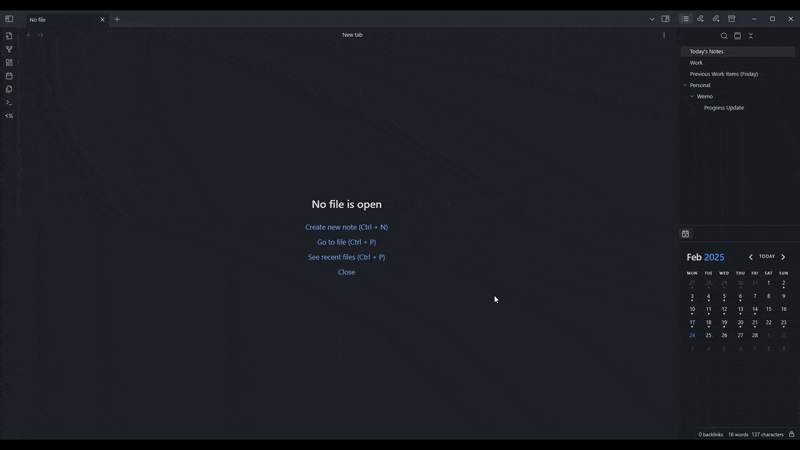

# Obsidian Daily Notes Template with Smart Previous-Entry Lookup


A Templater-powered daily note template for Obsidian that automatically finds and embeds your most recent work section — skipping empty days. Useful for developers and knowledge workers who want fast access to previous work items during standups, reviews, or weekly recaps.

## Features

- Finds your last work entry
- Skips empty work logs automatically
- Works with any folder structure
- Built-in safety limits to prevent infinite loops
- Perfect for quick reference during meetings

## Preview



## Prerequisites

- Obsidian v1.8.7+
- Templater plugin

## Installation

1. Install the [Templater](https://github.com/SilentVoid13/Templater) plugin in Obsidian
2. Copy `template.md` to your Obsidian templates folder
3. Configure the template path in your daily notes settings
4. Customize the file path in the template to match your vault structure

## How It Works

Let's break down the key components:

### 1. Configuration Block
```javascript
const SECTION_NAME = "Work";               // Section heading to look for
const DAILY_NOTES_FOLDER = "";             // e.g. "Daily Notes/" — leave empty for vault root
const FILENAME_FORMAT = "YYYY-MM-DD-dddd"; // Match your daily note filename format
const MAX_DAYS_TO_LOOK = 14;               // How far back to search
```
All customization lives here — no need to touch the logic below.

### 2. Date Initialization
```javascript
const currentNoteDate = moment(tp.file.title.split('-').slice(0, 3).join('-'), 'YYYY-MM-DD');
let checkDate = currentNoteDate.clone().subtract(1, 'days');
```
This gets us started with yesterday's date.

### 3. Smart Search Logic
```javascript
while (!fileFound && daysChecked < MAX_DAYS_TO_LOOK) {
```
Looks back up to `MAX_DAYS_TO_LOOK` days, preventing infinite loops. Handy for longer breaks or holidays.

### 4. File Path Handling
```javascript
const fileName = checkDate.format(FILENAME_FORMAT);
const filePath = `${DAILY_NOTES_FOLDER}${fileName}.md`;
```
The folder and format are driven by the configuration block at the top.

### 5. Content Validation
```javascript
const sectionRegex = new RegExp(`# ${SECTION_NAME}\\n([\\s\\S]*?)(?=\\n# |$)`);
const workSection = content.match(sectionRegex);

if (workSection && workSection[1].trim().length > 0) {
```
Matches only top-level `# ` headings as boundaries, so sub-headings like `## Tickets` inside the section are included rather than truncating the match.

## Customization

### File Path Structure
Set `DAILY_NOTES_FOLDER` at the top of the template:
```javascript
const DAILY_NOTES_FOLDER = "Daily Notes/";
const DAILY_NOTES_FOLDER = "Journal/";
const DAILY_NOTES_FOLDER = "Notes/Daily/";
```

### Lookback Period
Adjust `MAX_DAYS_TO_LOOK` at the top of the template:
```javascript
const MAX_DAYS_TO_LOOK = 14;  // Change this number
```

### Section Names
Change `SECTION_NAME` at the top of the template:
```javascript
const SECTION_NAME = "Work";  // Change to match your section heading
```

## Troubleshooting

### Common Issues

1. **Template Not Working**
   - Check if Templater is enabled
   - Verify template folder path
   - Ensure file paths match your structure

2. **No Previous Items Showing**
   - Verify previous notes exist
   - Check if Work section has content
   - Confirm file paths match your structure

3. **Error Messages**
   - Check Templater syntax
   - Verify JavaScript syntax
   - Ensure section headers match template

## Contributing

Contributions are welcome! Feel free to:
- Submit bug reports
- Suggest new features
- Create pull requests
- Share your customizations

For major changes, please open an issue first to discuss what you'd like to change.

## License

[MIT](https://choosealicense.com/licenses/mit/)